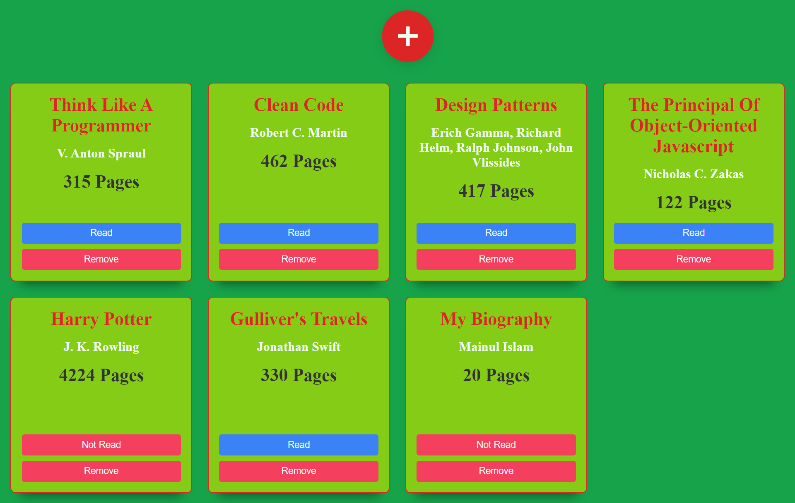
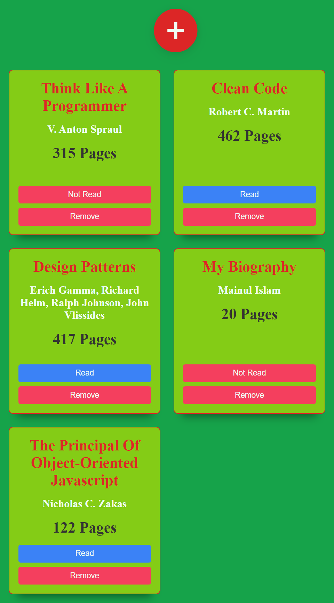
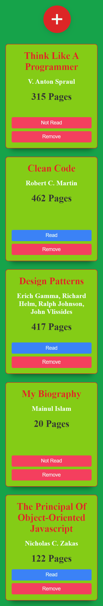

# book-library
A book library where you can add, remove, and update books.

Hello, this is my 8th project here in [The Odin Project](https://www.theodinproject.com/). It's a book library where you can add remove and update the details of your favorite books. You can keep track of your book whether it's read or not read. The books will be saved in the browser's local storage and your books won't vanish after refreshing the browser.

## Table of contents
- [Overview](#overview)
  - [Requirement](#project-requirement)
  - [Solution Screenshot](#solution-screenshot)
  - [Links](#links)
  - [Built with](#built-with)
  - [What I learned](#what-i-learned)
- [Author](#author)

### Project-Requirement
Have to implement an online library where people can add, remove, and update books.

### Solution Screenshot
The final output:
- Desktop-View

- Tablet-View

- Mobile-View

### Links
Live Site URL: [Live site of the challenge hosted here](https://mainul-islam-nirob.github.io/book-library/)

### Built with
- HTML5
- CSS
    - FlexBox
    - Grid
- JavaScript
  - Objects and Object Constructors
  - Class
- Local Storage

### What I learned
- How to use LocalStorage
- How to create a pop-up modal form without using any library or framework
- etc

## Author
- Website - Well I haven't made my portfolio, gonna make it soon when I know a lot of stuffs.
- LinkedIn - [@mainul islam](https://www.linkedin.com/in/mainul-islam-nirob/)
